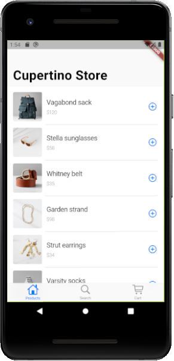
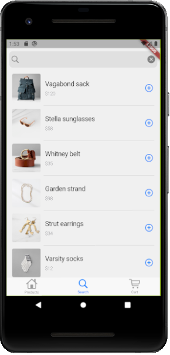
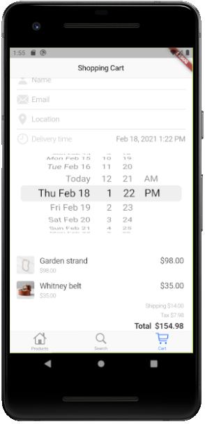

# Flutter Cupertino Store 🛍️ 

Building a Store App using  Cupertino Widgets (that looks totally at home on an iOS device).

## Getting Started

This project is a starting point for Building a Store App using  Cupertino Widgets.

If you want a “big picture” understanding of the Cupertino Store, start with
- [Lab: Building a Cupertino app with Flutter](https://codelabs.developers.google.com/codelabs/flutter-cupertino#0)

A few resources to get you started if this is your first Flutter project:

- [Lab: Write your first Flutter app](https://flutter.dev/docs/get-started/codelab)
- [Cookbook: Useful Flutter samples](https://flutter.dev/docs/cookbook)

For help getting started with Flutter, view our
[online documentation](https://flutter.dev/docs), which offers tutorials,
samples, guidance on mobile development, and a full API reference.

## Screenshots 🎉

<table >
 <tr>
  <td></td>
  <td></td>
  <td></td>
 </tr>
</table>
